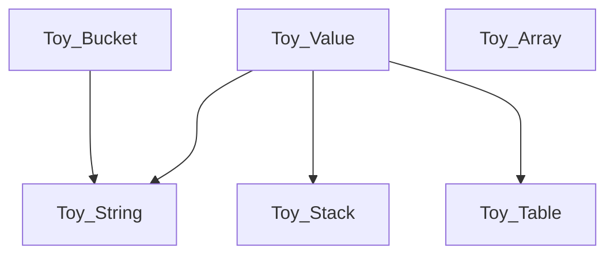

# Welcome to the Toy Programming Language

I'm extremely appreciative to have people contribute their time and expertise towards this project. Before I get into the details, let me give some high level goals:

* Toy is intended to work as an embedded scripting language inside a game engine, tentatively titled "Box".
* Toy's goal is to allow for a great degree of modability for any games developed with the Box engine.
* As such, using Toy itself should be easy for novice and veteran coders.
* Toy is developed with a focus on speed, efficient resource management, and portability.
* Toy should be a source of fun for everyone working on and using it.

# Where to Start

First, the main development branch of Toy is 'v2', with the branches 'v1' and 'v1-docs' kept for reference.

v2 is a ground-up rewrite, with additions, changes and deletions to the language that make sense. If you want to discuss the direction things are going, the [Discussions Tab](https://github.com/Ratstail91/Toy/discussions) is perfect for that.

The [Issue Tracker](https://github.com/Ratstail91/Toy/issues) is a good place to see what tasks and issues are currently waiting to be addressed. The [toy.h](https://github.com/Ratstail91/Toy/blob/v2/source/toy.h) source file is a quick way to see what building blocks are available in the source code. There are also a number of comments prepended with `TODO` scattered throughout the source code, as reminders of planned features.

The [test cases](https://github.com/Ratstail91/Toy/tree/v2/tests/cases), which test individual parts of the code in isolation, can be a good way to see how those parts are used. Likewise, the [REPL](https://github.com/Ratstail91/Toy/tree/v2/repl) shows a practical usage of Toy.

*v2 is under heavy development, and as such may not be in a working state yet. Your patience and feedback can help, but missing features such as a documentation website are coming, eventually.*

# Building Blocks

These data structures should be as independent as they can be, but there are some dependencies:



In addition, [toy_common.h](https://github.com/Ratstail91/Toy/blob/v2/source/toy_common.h) grants platform portability and version info, while [toy_console_colors.h](https://github.com/Ratstail91/Toy/blob/v2/source/toy_console_colors.h) provides string constants as macros that help with console output (where supported).

# Coding Habits

Here's a few coding habits that I use to keep the source code consistent. While I'd prefer contributors to follow these, breaking these guidelines are ok if you need to.

## Testing The Language

When adding a new piece of code, it must be thoroughly tested via a [test case](https://github.com/Ratstail91/Toy/tree/v2/tests/cases). If it has multiple features, they should be tested individually, and in combination with each other. Any kind of corner case which can cause an issue on any supported platform must be resolved (I'm happy to help with this, if needed).

This is probably the most important habit listed here. While I'm not too fussy as to how the tests are written, they do need to prove that the code works flawlessly. Toy is intended to be used by others (potentially many others), so please write simple and straight forward tests to ensure correctness.

## Tabs, 4 Characters Wide

I use tabs over spaces, with a width of 4. I don't have a linter, please don't make me use one.

## Error Messages

Fatal errors have this general format:

```c
fprintf(stderr, TOY_CC_ERROR "ERROR: [Info]\n" TOY_CC_RESET);
exit(-1);
```

The use of `fprintf()` will ensure the error is written to the console, and allows extra information to be printed - just replace `[Info]` with the relevant output. These kinds of fatal errors are intended to catch issues with the language itself, rather than errors in the Toy scripts.

In the test cases, the `exit(-1)` is instead replaced with `return -1` to allow `main()` to clean up that test set, and run others if needed.

## Naming Things

To ensure integrating Toy as an external library is easy, any functions that are intended for use should be:

* Marked with the macro `TOY_API`
* Prepended with `Toy_`
* Be named with lowerCamelCase
* Begin their name with a verb

Likewise, publicly visible structures should be:

* Prepended with `Toy_`
* Be named with UpperCamelCase

If you use a macro, ensure it is all uppercase, and prepended with `TOY_`. If there's a function that is exposed, but is intended to be used within a macro, prepending its name with `Toy_private_` is a good idea.

e.g.

```c
#include "toy_common.h"

typedef struct Toy_Thing {
	int member;
} Toy_Thing;

TOY_API void Toy_useThing();

#define TOY_USE_OTHER_THING() Toy_private_useOtherThing()
TOY_API void Toy_private_useOtherThing();
```

## Data Type Sizes

Within `toy_common.h`, the macro `TOY_BITNESS` is defined as either 32 or 64, depending on if Toy is compiled for 32 or 64 bit platforms (if it doesn't recognise a platform, it is set to -1).

Most, if not all the structures within Toy where memory layout is important have some comments indicating their sizes in memory based on bitness. These comments are only a guide, and should NOT be taken as gospel, but they're useful for thinking about how the data is laid out in memory. Spaces are used to line them up.

```c
//Copied from toy_stack.h
typedef struct Toy_Stack { //32 | 64 BITNESS
	unsigned int capacity; //4  | 4
	unsigned int count;    //4  | 4
	char data[];           //-  | -
} Toy_Stack;               //8  | 8
```

## Single and Double Pointers

Double pointers are used quite often, especially when a function performs some kind of operation on a structure itself, rather than just its data. I refer to these as "handles", and are usually named as such.

## Directories

The directories in the repository's root have certain intended uses. If you find a folder which is empty except for a file named `.gitkeep`, leave it be, as that file is simply used to retain that directory within git for later use.

| Directory | Intended Use |
| --- | --- |
| .github | Meta information used by GitHub, such as CI workflows and issue templates. |
| .notes | General storage for any kind of scratch notes or reminders, or random bits of source code that aren't needed. Rough ideas and plans are usually found here, but may be outdated. |
| lib | The source directory for various libraries external to Toy, but which can be made available by the host and accessed with the `import` keyword. |
| scripts | Storage for various example scripts written in Toy that can be loaded and executed by the repl. |
| source | The source directory for the core of the Toy programming language. |
| tests | The source directory for the testing systems. Within, `cases/` is used for test cases, `benchmarks/` for benchmarking, etc. |
| tools | The source directory for various external tools. |

